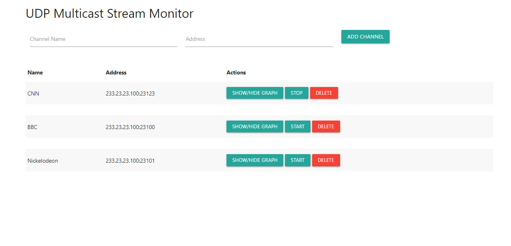
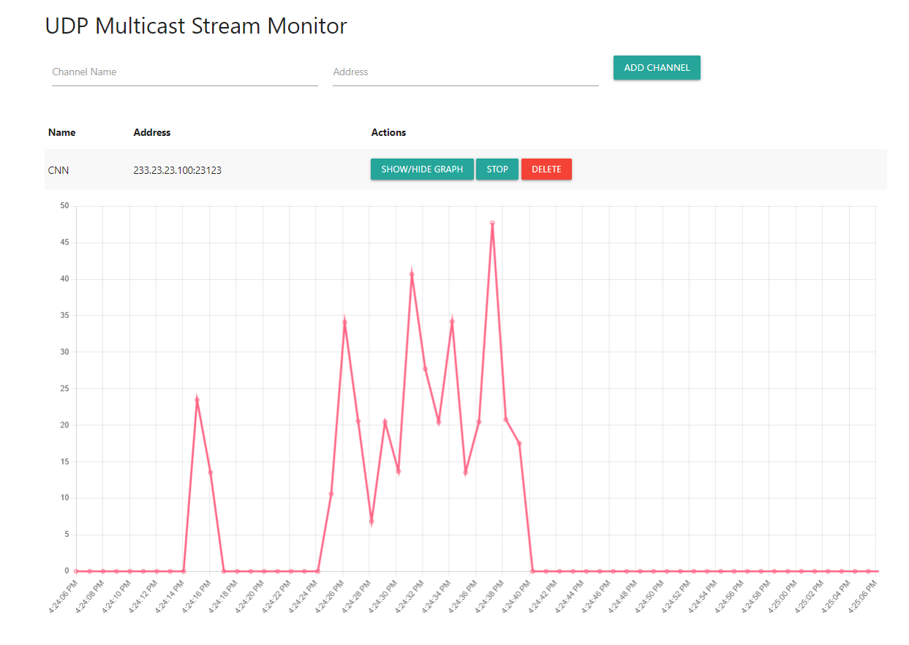

# UDP Multicast Stream Monitor

## Overview
The UDP Multicast Stream Monitor is a web application built with Flask that allows you to monitor UDP multicast streams and visualize packet loss data over time. It provides a dashboard where you can add, configure, and monitor multiple channels.

## Features
- Add and configure channels with names and addresses
- Start and stop monitoring for each channel
- Visualize packet loss data over time on interactive line charts
- Toggle visibility of individual channel graphs
- View data for specific time ranges

## Prerequisites
- Python 3.x
- Flask 2.1.1
- python-dateutil 2.8.2

## Installation
1. Clone this repository to your local machine.
2. Navigate to the project directory.
3. Create a virtual environment (recommended) and activate it.
4. Install the required packages using the command:

## Usage
1. Run the Flask app:
2. Access the application in your web browser by navigating to `http://localhost:5000`.

## How It Works
- The Flask app provides endpoints for adding, configuring, and monitoring channels.
- Each channel's packet loss data is logged to a file named `<channel_name>.log`.
- The dashboard shows a table of configured channels and their monitoring status.
- Graphs display the packet loss data for the last 10 minutes, updated every second.
- You can toggle graph visibility and start/stop monitoring for each channel.

## Contributing
Contributions are welcome! Feel free to submit issues or pull requests for bug fixes, enhancements, or new features.

## License
This project is licensed under the MIT License. See the [LICENSE](LICENSE) file for details.
